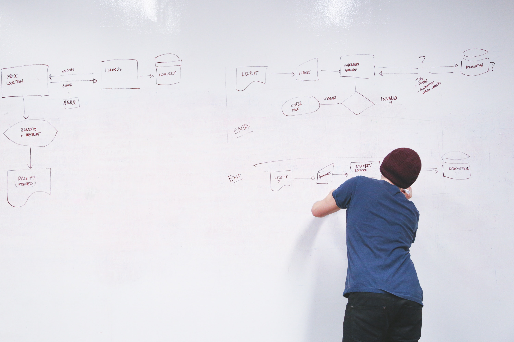

多一些不为什么的坚持。
<!-- more -->
跑步、早起、主动学习、列计划、独处…自律真的能改变人生？？
2018年是我下决心改变的一年，很久没有坚持很久做一件事了，都是快节奏的生活。不敢说它能真的带给我开天辟地的改变但方向正确，坚持就是有意义的！
能不能改变人生，我心里并没有答案，至少现在没有。能改变那是顺其自然，不能改变我想也必有收获，最基本坚持了不为什么的坚持。

有句话我还是挺有体会（个人想法）的---“我从未见过一个早起勤奋谨慎诚实的人抱怨命运不好；良好的品格、优秀的习惯，坚强的一直，是不会被假设所谓的命运击败的”。
周围人都说已经够努力了，但自己清楚自己的问题所在。人最难欺骗的是自己，最终都是需要“交学费”的！
坚持，仅喝几碗“鸡汤”坚持不久的，需要长期有意识的靠内在动力去要求自己也就是自律，最终变成习惯持续下去！
最近，坚持了这么久，也突然意识到，很多事情做不好可能我们真的不能只纠结于事情本身，看看其他方面有没有做好。没思路、没灵感，是不是休息不够？；没食欲，是不是缺少锻炼？没见识，是不是书读少了？hh……。
好熟悉的一句话，细细品味吧！see you!dear.

生活就像一盒巧克力，你永远不知道下一块会是什么味道。——《阿甘正传》 ​​​​